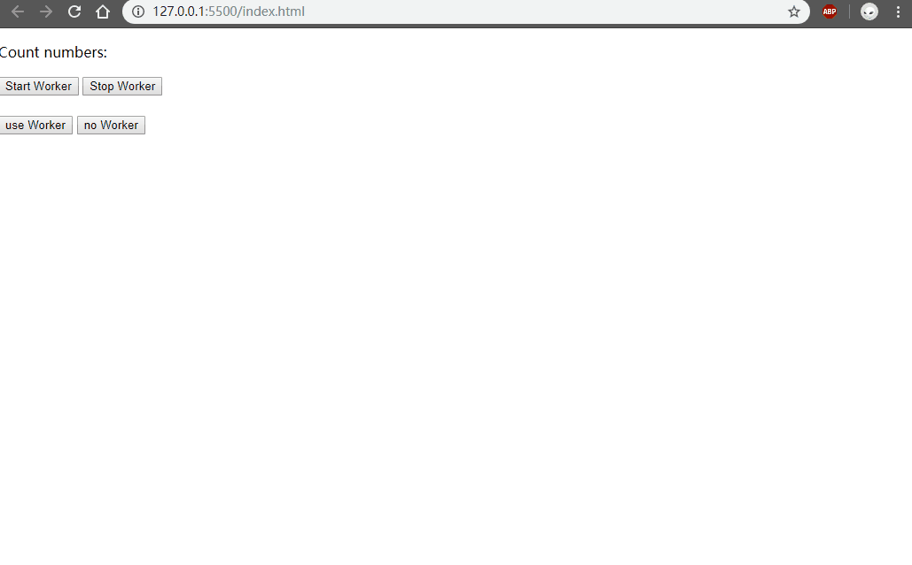

# Web Worker使用

## 内容
表达的内容为，当处理较大数据量时，使用webworker和不使用时浏览器窗口是否表现出卡顿。   

数据量有3W条，为表现明显一点，首先是将嵌套的数据转为一维数组，然后在将一维数组转为嵌套数据，在用ztree渲染

## 操作

参考资料：  
[JS异步那些事 四（HTML 5 Web Workers）](https://segmentfault.com/a/1190000005081783)   
[前端er来学习一下webWorker吧](https://juejin.im/post/5bf8fa045188252f170e0dcb)   
[浅谈HTML5 Web Worker](https://juejin.im/post/59c1b3645188250ea1502e46)   
[Web Worker 使用教程](http://www.ruanyifeng.com/blog/2018/07/web-worker.html)